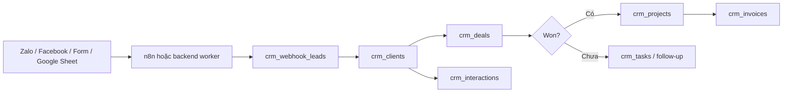

# ZakLife CRM Supabase Architecture

## Mục tiêu

CRM là module quản lý lead, deal, dự án và công nợ cho ZakLife. Đây là dữ liệu liên quan tới khách hàng và tiền nên nguồn dữ liệu chính đặt ở Supabase Postgres, không đặt trong Firebase RTDB như các module cá nhân hiện tại.

## Nguồn dữ liệu

| Phần | Nguồn chính | Ghi chú |
| --- | --- | --- |
| Lead / khách hàng | `public.crm_clients` | Một người hoặc một doanh nghiệp. |
| Cơ hội bán hàng | `public.crm_deals` | Kanban pipeline: new, contacted, quoted, negotiating, won, lost. |
| Lịch sử trao đổi | `public.crm_interactions` | Zalo, Facebook, call, meeting, note, webhook. |
| Dự án sau khi chốt | `public.crm_projects` | Sinh ra từ deal won. |
| Việc cần làm | `public.crm_tasks` | Follow-up, báo giá, task dự án. |
| Hóa đơn / phải thu | `public.crm_invoices` | Dùng để theo dõi tiền, chưa thay thế chứng từ kế toán chính thức. |
| Lead tự động | `public.crm_webhook_leads` | Cửa vào cho n8n/Zalo/Facebook/Google Sheet. |

## Luồng dữ liệu chuẩn



## Lead từ maichauhai.com về CRM

Form liên hệ ở portfolio `maichauhai.com` là nguồn lead chính cho CRM. Form hiện có 4 trường:

| Field trên form | Field chuẩn gửi vào CRM | Ghi chú |
| --- | --- | --- |
| Tên của bạn | `lead_name` | Tên người liên hệ. |
| SĐT hoặc Zalo | `contact_phone` và/hoặc `contact_zalo` | Nếu chỉ có một ô, gửi cùng giá trị vào cả hai field. |
| Bạn cần gì? | `need_type`, `need_label` | `need_type` là mã ngắn; `need_label` là nhãn người dùng thấy. |
| Mô tả ngắn về nhu cầu | `need_summary` | Nội dung tư vấn ban đầu. |

Payload chuẩn để n8n/Vercel Function ghi vào `public.crm_webhook_leads`:

```json
{
  "provider": "website",
  "external_id": "maichauhai-contact-20260612-001",
  "form_slug": "maichauhai_contact",
  "lead_name": "Anh Minh",
  "contact_phone": "0903927115",
  "contact_zalo": "0903927115",
  "contact_email": "",
  "need_type": "website_portfolio",
  "need_label": "Build website hoặc portfolio",
  "need_summary": "Muốn làm portfolio bán dịch vụ AI cho quán cafe.",
  "page_url": "https://maichauhai.com/#contact",
  "referrer_url": "",
  "utm_source": "",
  "utm_medium": "",
  "utm_campaign": "",
  "payload": {
    "raw_form_name": "portfolio_contact"
  }
}
```

Các giá trị `need_type` được chuẩn hóa:

| `need_type` | Ý nghĩa trong CRM |
| --- | --- |
| `ai_mentoring` | AI 1-1 Mentoring. |
| `website_portfolio` | Website hoặc portfolio. |
| `pos_crm` | POS, CRM hoặc dashboard quản lý. |
| `automation` | Tự động hóa workflow. |
| `content_auto_post` | Content calendar, auto-post, n8n. |
| `other` | Nhu cầu khác hoặc chưa phân loại. |

Khi một dòng `crm_webhook_leads` mới được insert, trigger DB sẽ:

1. Chuẩn hóa field từ cột typed hoặc từ `payload`.
2. Tìm khách cũ theo `contact_phone` hoặc `contact_email`.
3. Nếu chưa có khách, tạo `crm_clients`.
4. Tạo một `crm_deals` ở stage `new`.
5. Tạo một `crm_interactions` loại `webhook` để lưu nội dung khách gửi.
6. Cập nhật webhook lead thành `processed`, gắn `client_id` và `deal_id`.

Như vậy portfolio/n8n chỉ gửi một bản ghi vào `crm_webhook_leads`, CRM tự sinh phần còn lại.

Không để form portfolio ghi thẳng vào Supabase từ browser bằng anon key. Form nên gọi n8n webhook hoặc Vercel Function; backend đó giữ service role key và insert vào `crm_webhook_leads`.

## Bảo mật

- Frontend chỉ dùng Supabase publishable/anon key.
- Service role key chỉ được đặt ở VPS, n8n hoặc backend worker. Không đưa vào GitHub, Vercel public env, hoặc file JS.
- Tất cả bảng trong `public` đều bật RLS.
- Frontend chỉ đọc/ghi được khi user đăng nhập Supabase Auth và user đó có trong `public.crm_members`.
- Helper function dùng `security definer` được đặt trong schema `private`, không đặt ở schema public.
- View public dùng `security_invoker = true` để không bypass RLS.

## Vai trò nội bộ

`crm_members.role`:

| Role | Quyền |
| --- | --- |
| `owner` | Toàn quyền CRM. |
| `admin` | Quản thành viên, nguồn lead, toàn bộ dữ liệu CRM. |
| `member` | Đọc/ghi lead, deal, task, dự án, hóa đơn. |
| `viewer` | Chỉ đọc. |

Sau khi chạy migration, cần thêm admin đầu tiên bằng SQL Editor hoặc service role:

```sql
insert into public.crm_members (user_id, role)
values ('<SUPABASE_AUTH_USER_ID>', 'owner')
on conflict (user_id) do update
set role = excluded.role,
    is_active = true,
    updated_at = now();
```

## Realtime

Migration đã thử thêm các bảng chính vào publication `supabase_realtime`. Nếu Supabase project chưa bật Postgres Changes cho bảng mới, vào:

`Database > Publications > supabase_realtime`

và bật các bảng:

- `crm_clients`
- `crm_deals`
- `crm_interactions`
- `crm_projects`
- `crm_tasks`
- `crm_invoices`

## Data API grants

Supabase đã thay đổi hướng mặc định để bảng mới không tự exposed qua Data API ở một số project mới. Migration đã grant rõ cho `authenticated`, không grant cho `anon`. Nếu frontend báo permission denied, kiểm tra:

- `Integrations > Data API > Exposed schemas`
- SQL grants trong migration
- user hiện tại đã có dòng trong `crm_members` chưa

## Cách chạy trên Supabase

Hiện repo chưa có Supabase CLI. Có 2 cách:

1. Mở Supabase SQL Editor, chạy:
   - `supabase/migrations/202606120001_zaklife_crm_core.sql`
   - tùy chọn: `supabase/seed/zaklife_crm_seed.sql`
2. Sau này khi cài Supabase CLI:
   - link project
   - đưa file này vào migration history đúng chuẩn CLI
   - chạy advisors trước khi production

## Cấu hình frontend ZakLife

Tab CRM đã có nút `Kết nối` để lưu Supabase URL, anon/publishable key và đăng nhập email/password. Có thể dùng UI này thay vì mở console.

Nếu cần cấu hình thủ công trong browser console:

```js
localStorage.setItem('zaklifeSupabaseConfig', JSON.stringify({
  url: 'https://<project-ref>.supabase.co',
  anonKey: '<sb_publishable_or_anon_key>'
}));
```

Sau khi refresh, tab CRM sẽ đọc Supabase. Nếu chưa có config hoặc chưa đăng nhập, CRM hiển thị dữ liệu demo để anh test UI trước.

## Tài liệu Supabase đã đối chiếu

- Row Level Security: https://supabase.com/docs/guides/database/postgres/row-level-security
- Securing your API: https://supabase.com/docs/guides/api/securing-your-api
- Realtime Postgres Changes: https://supabase.com/docs/guides/realtime/postgres-changes
- Changelog: https://supabase.com/changelog.md
